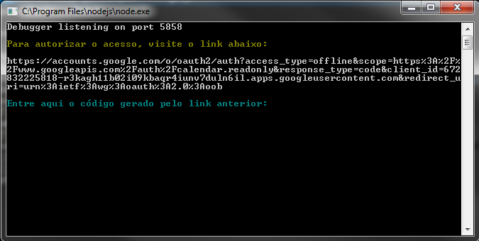

# Download de eventos do Google Calendar

Download de todos os eventos futuros de sua agenda do Google Agenda em formato CSV.

## Setup

Os passos a seguir precisam ser seguidos apenas uma vez.

1. Baixar e [instalar o nodeJs](https://nodejs.org/en/download/)
2. Baixar o código deste repositório - *basta clicar no botão **'Download ZIP'** nesta página*
3. [Obter um ID de OAuth2](https://developers.google.com/google-apps/calendar/quickstart/nodejs#step_1_turn_on_the_api_name) válido junto ao Google
  3.1 Não se esqueça de salvar seu arquivo ```client_secret.json``` no mesmo diretório desta aplicação
4. Executar os seguintes comandos (de dentro do diretório da aplicação)
    4.1 Baixar as dependências do projeto
    ```javascript
    npm update
    ```

    4.2 Executar a aplicação
    ```javascript
    node gcn.js
    ```
5. Acesse o link que a aplicação vai gerar
    
6. Em seguida, confirme as permissões
    
    
7. Profit!

### Futuras execuções
Para executar novamente a aplicação, basta apenas executar o comando (de dentro do diretório da aplicação):
    ```javascript
    node gcn.js
    ```

## Estrutura do arquivo CSV
   
    ```sumário```;
    ```data início```;
    ```data fim```;
    ```local```;
    ```email do organizador```;
    ```nome do organizador```;
