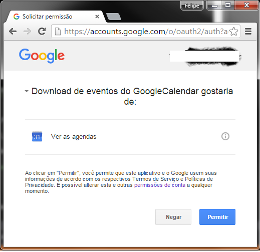
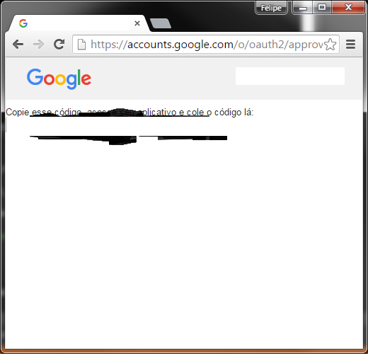

# Google Calendar events to CSV

Downloads all future events from your Google Calendars and saves it as a CSV file.

## Setup

Follow the steps bellow *just once*.

1. Download and install [NodeJS](https://nodejs.org/en/download/)

2. Download this repo - *just click on the `Download ZIP` button available in this very page*

3. [Create a valid OAuth2 ID](https://developers.google.com/google-apps/calendar/quickstart/nodejs#step_1_turn_on_the_api_name)

  3.1 Remember to save your `client_secret.json` in the directory you've saved this code
  
4. Run the following commands (from within this application's directory)

    4.1 Restore [all dependencies](https://github.com/felipegtx/googleCalendarNode/blob/master/package.json#L10-L16) from this project
    ```javascript
    npm update
    ```

    4.2 Run the application
    ```javascript
    node gcn.js
    ```
5. Follow the steps through the page opened by the application
    
6. Allow the app to access your data

    

    
    
7. Profit!

### Future executions

After the first full run, all you need to do in order to gather your data from Google's servers is to run the command `node gcn.js` from within the application directory.

## CSV file structure
   
  1. Event description (summary)
  2. Event start
  3. Event end
  4. Location
  5. Event organizer's email address
  6. Event organizer's display name
